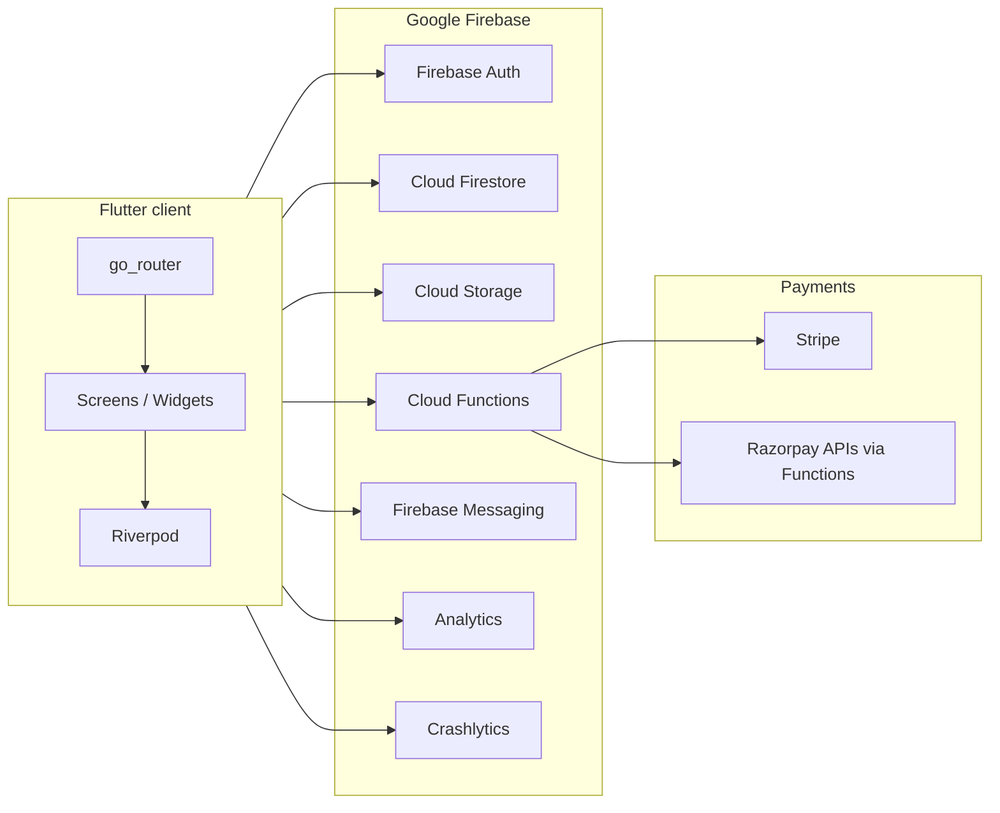

# Rapid Reels — Modules, Features & Technology Documentation

**Product:** Rapid Reels — platform for booking event video/reel creation, provider fulfillment, discovery of public reels, payments, referrals, and administration.

**Codebase:** Flutter monolith (`rapid_reels_app/`) with Firebase backend and Cloud Functions (`rapid_reels_app/functions/`). The app is **cross-platform** (Android, iOS, Web, desktop targets per Flutter); several integrations (for example Stripe’s native Payment Sheet) are **mobile-oriented**, with web-safe routing patterns noted in code.

---

## 1. User roles

Roles are enforced in **Firestore Security Rules** and reflected in the **`users` document** field `userType`.

| Role | `userType` value | Primary capabilities |
|------|------------------|----------------------|
| **Customer** | `customer` (default in model) | Browse discover feed, book events, pay, track bookings, receive reels, referrals/wallet, profile |
| **Provider** | `provider` | Onboarding, catalogue, availability, bookings, uploads, reel delivery, earnings, live event tooling |
| **Admin** | `admin` | Admin console: users, bookings, providers, content, analytics, payments, offers, reviews |
| **Super admin** | `superadmin` | Same gate as admin for protected routes (`userType in ['admin', 'superadmin']`) |

**Implementation notes**

- **Admin access:** `GoRouter` redirects protected `/admin-*` routes using `AdminRouteCache`, which loads the current user profile from Firestore and checks `firebase_admin_role.dart` (aligned with `firestore.rules` `isAdmin()`).
- **Provider visibility:** Rules allow reading other users’ docs when `userType == 'provider'` and `isActive == true` (public provider discovery).
- **Separate admin login:** `AdminLoginScreen` uses email/password; Firestore must still mark the account as `admin` or `superadmin`.

---

## 2. High-level architecture

- **Presentation:** Flutter Material 3 UI, dark theme (`AppTheme`), shared widgets under `lib/shared/`.
- **State:** `flutter_riverpod` providers per feature.
- **Navigation:** `go_router` with refresh notifiers, admin guard, and web-safe `extra` handling.
- **Data:** Firestore-first models in `lib/core/firebase/models/`, accessed largely through `FirestoreService` and feature repositories/adapters.

---

## 3. Technology stack (by layer)

### 3.1 Client application (Flutter)

| Concern | Technology | Package / artifact (from `pubspec.yaml`) |
|---------|------------|----------------------------------------|
| Framework | Flutter | SDK `^3.10.4` |
| Language | Dart | (with SDK) |
| State management | Riverpod | `flutter_riverpod: ^2.4.0` |
| Routing | Declarative router | `go_router: ^14.6.2` |
| Typography / icons | Google Fonts, Material | `google_fonts`, `cupertino_icons` |
| Images / SVG / placeholders | Caching, vectors, shimmer, Lottie | `cached_network_image`, `flutter_svg`, `shimmer`, `lottie` |
| Video | Inline playback | `video_player: ^2.9.2` |
| Media capture | Gallery / camera | `image_picker: ^1.1.2` |
| Maps | Google Maps embed | `google_maps_flutter: ^2.9.0` |
| Location | GPS + reverse geocode | `geolocator`, `geocoding` |
| Permissions | Runtime permissions | `permission_handler` |
| Networking | HTTP client | `http: ^1.2.2` |
| Sharing / deep links helpers | System share / URLs | `share_plus`, `url_launcher` |
| Local persistence | Key–value + NoSQL local | `shared_preferences`, `hive`, `hive_flutter` |
| Identity & sign-in | Firebase Auth, Google | `firebase_auth`, `google_sign_in` |
| Backend data | Firestore | `cloud_firestore` |
| Server logic | Callable / HTTP functions | `cloud_functions` |
| File storage | Firebase Storage | `firebase_storage` |
| Push | FCM | `firebase_messaging` |
| Quality / analytics | Analytics, Crashlytics | `firebase_analytics`, `firebase_crashlytics` |
| Abuse mitigation (declared) | App Check client | `firebase_app_check` *(listed in pubspec; not referenced in `lib/` at time of writing)* |
| Payments (mobile) | Stripe Payment Sheet | `flutter_stripe: ^12.4.0` |
| UI polish | Carousel, dots, ratings, calendar | `carousel_slider`, `dots_indicator`, `flutter_rating_bar`, `table_calendar` |
| IDs | UUIDs | `uuid` |
| Formatting | Dates/numbers | `intl` |

**Runtime note (Stripe):** `main.dart` initializes `Stripe.publishableKey` only on **Android/iOS**, not on web (`kIsWeb`). Payment flows may differ by platform.

### 3.2 Backend (Firebase)

| Service | Purpose in Rapid Reels |
|---------|------------------------|
| **Firebase Auth** | Phone OTP, Google Sign-In, admin email/password |
| **Cloud Firestore** | Users, providers, bookings, reels, reviews, referrals, wallet transactions, notifications, offers, live events, support tickets, admin analytics |
| **Cloud Storage** | Profile photos, provider uploads (portfolio, documents, reels), admin banners (`storage.rules`) |
| **Cloud Functions (Node 20)** | Booking-side effects, referrals, **Stripe** PaymentIntent + webhook, **Razorpay** order/verify HTTP endpoints, scheduled reminders, reel delivery notifications |
| **FCM** | Push notifications (also written to `notifications` collection from Functions) |
| **Firebase Analytics** | Event and user property logging (`FirebaseInitService`) |
| **Firebase Crashlytics** | Non-debug fatal/non-fatal error reporting |

### 3.3 Cloud Functions stack (`functions/package.json`)

| Dependency | Role |
|------------|------|
| `firebase-functions` (v2 APIs in code) | HTTPS `onRequest`, callable `onCall`, Firestore `onDocumentCreated`, scheduler `onSchedule` |
| `firebase-admin` | Firestore, Messaging, etc. |
| `stripe` | Server-side PaymentIntents, webhooks |
| `razorpay` | Alternative payment path (HTTP endpoints in `index.js`) |
| `dotenv` | Local/emulator configuration |

### 3.4 Security & configuration

| Artifact | Role |
|----------|------|
| `firestore.rules` | Role-based read/write for all collections |
| `storage.rules` | User avatars (public read), provider paths, admin banners |
| `.env` / Firebase secrets | Stripe keys (`STRIPE_SECRET_KEY`, `STRIPE_WEBHOOK_SECRET`), etc. |

---

## 4. Functional modules (feature folders)

Below, each **module** maps to `lib/features/<name>/`, lists representative **screens**, and ties **tech** to **capabilities**.

### 4.1 Auth (`features/auth`)

**Purpose:** Onboarding, phone login + OTP, profile setup, city selection, splash, unauthorized fallback.

| Screen / area | Related stack |
|---------------|----------------|
| `splash_screen`, `onboarding_screen`, `phone_login_screen`, `otp_verification_screen` | Firebase Auth (phone), reCAPTCHA settings in repository |
| `profile_setup_screen`, `city_selection_screen` | Firestore user profile |
| `unauthorized_screen` | Shown when non-admin hits admin routes |

Also uses **`google_sign_in`** via `AuthRepository` for Google authentication.

### 4.2 Home (`features/home`)

**Purpose:** Main entry hub and discovery shortcuts.

| Screen | Related stack |
|--------|----------------|
| `home_screen`, `schedule_packages_screen` | Navigation to booking/discover; likely Firestore for banners/content |

### 4.3 Discover (`features/discover`)

**Purpose:** Browse public reel feed and trending content.

| Screen | Related stack |
|--------|----------------|
| `main_discover_screen`, `discover_feed_screen`, `trending_reels_screen` | Firestore `reels` (public `isPublic`, statuses `delivered`/`published`), `video_player`, `cached_network_image` |

### 4.4 Reels (`features/reels`)

**Purpose:** Customer reel library, player, sharing.

| Screen / logic | Related stack |
|----------------|----------------|
| `reel_player_screen`, `reel_share_screen`, gallery screens | `video_player`, `share_plus`, Firestore/Storage URLs |
| `reel_engagement.dart` | Likes/analytics updates per `firestore.rules` (restricted field diff) |

### 4.5 Booking (`features/booking`)

**Purpose:** End-to-end event booking: type → packages → details → venue → provider → catalogue/package pick → customization → summary → **payment** → confirmation; transaction history.

| Screen | Related stack |
|--------|----------------|
| `event_type_selection_screen`, `package_selection_screen`, `event_details_form_screen` | Domain models + Firestore `bookings` |
| `venue_selection_screen` | `google_maps_flutter`, `geolocator` / `geocoding` |
| `provider_selection_screen`, `provider_portfolio_screen`, `provider_details` (see `providers` feature) | Firestore `providers`, `users` |
| `catalogue_selection_screen`, `catalogue_event_detail_screen`, `provider_package_pick_screen`, `package_customization_screen` | Subcollection `providers/{id}/catalogue_events` |
| `booking_summary_screen`, `payment_screen`, `payment_success_screen`, `payment_failure_screen` | **Stripe:** `StripePaymentService` → callable `createStripePaymentIntent`; `flutter_stripe` on mobile |
| `my_transactions_screen` | Bookings / wallet-related UI |

**Data path:** `BookingRepository` / `booking_firebase_adapter.dart` map domain ↔ Firestore (`firebase_booking_model.dart`).

### 4.6 Providers (browse) (`features/providers`)

**Purpose:** Customer-facing provider detail while booking.

| Screen | Related stack |
|--------|----------------|
| `provider_details_screen` | Firestore provider + public user fields |

### 4.7 Provider portal (`features/provider`)

**Purpose:** Provider lifecycle: registration, business profile, portfolio & documents, service areas, availability, verification, catalogue CRUD, dashboard, bookings calendar/timeline/status, customer contact, venue navigation, pre-event checklist, live event mode, footage upload, reel editor, earnings, login.

**Navigation & theme:** Signed-in hub uses **`StatefulShellRoute`** under `/provider-portal/:providerId` with bottom tabs **Home · Schedule · Bookings · Earnings · Account** (`ProviderPortalShell`, `ProviderBottomNavBar`). Legacy URLs `/provider-dashboard/:id`, `/provider-bookings/:id`, and `/provider-earnings/:id` **redirect** into this shell. Provider-only screens use **`ProviderAppTheme`** (orange accent, charcoal surfaces, Poppins) at the router; the customer app keeps the neon theme.

**Earnings:** `provider_earnings_screen` aggregates **`payment_transactions`** where `providerUserId` matches, sums **gross** for `status == succeeded`, and shows **estimated net** using `commissionRate` on the provider document. **Bank / payout** fields live on `providers.bankDetails` (`ProviderBankDetailsScreen`).

| Screen | Related stack |
|--------|----------------|
| Registration / verification chain | Firestore `providers`, Storage under `providers/{providerId}/**` |
| `provider_schedule_screen` | Embedded `provider_booking_calendar_screen` + `provider_availability_calendar_screen` |
| `provider_account_screen`, `provider_bank_details_screen` | Firestore `providers` |
| `provider_availability_calendar_screen` | `table_calendar`, Firestore |
| `upload_footage_screen`, `provider_portfolio_upload_screen`, `provider_document_upload_screen` | `firebase_storage`, `image_picker` |
| `provider_catalogue_list_screen`, `provider_catalogue_edit_screen` | `catalogue_events` subcollection |
| `provider_bookings_screen`, `provider_booking_details_screen`, calendars/timeline/status | Firestore `bookings`, `live_events` |
| `provider_venue_navigation_screen` | Maps / geolocation |
| `reel_editor_screen`, `provider_my_reels_screen` | Video playback/editing UX; Storage + Firestore `reels` |
| `live_event_mode_screen`, `provider_pre_event_checklist_screen` | Operational workflows tied to bookings |

### 4.8 My events (`features/my_events`)

**Purpose:** Customer’s bookings, event detail, live tracking.

| Screen | Related stack |
|--------|----------------|
| `my_events_screen`, `event_details_screen`, `live_event_tracking_screen`, enhanced/dynamic variants | Firestore `bookings`, `live_events` |

### 4.9 Profile (`features/profile`)

**Purpose:** Profile hub, edit profile, saved venues, payment methods, settings, support entry, tickets.

| Screen | Related stack |
|--------|----------------|
| `main_profile_screen`, `profile_screen`, `dynamic_profile_screen`, `edit_profile_screen` | Firestore `users`, Storage `user_profile_pics/{uid}/` |
| `saved_venues_screen`, `payment_methods_screen`, `settings_screen`, `support_screen`, `my_tickets_screen` | Mixed: Firestore, possibly `support_tickets` |

### 4.10 Notifications (`features/notifications`)

**Purpose:** In-app notification list.

| Screen | Related stack |
|--------|----------------|
| `notifications_screen` | Firestore `notifications`; push via FCM |

### 4.11 Offers (`features/offers`)

**Purpose:** Browse/apply promotional offers.

| Screen | Related stack |
|--------|----------------|
| `offers_screen`, `offers_coupons_screen` | Firestore `offers`; per-user `users/{uid}/offer_usage` |

### 4.12 Referral & wallet (`features/referral`, `features/wallet`)

**Purpose:** Referral dashboard/history/redemption and wallet/transaction views.

| Screen | Related stack |
|--------|----------------|
| `referral_dashboard_screen`, `referral_history_screen`, `redemption_screen`, `wallet_screen` | Firestore `referrals`, `wallet_transactions`, user wallet fields |
| `wallet_transaction_screen`, `transaction_history_screen` (`features/wallet`) | Ledger UI |

Cloud Function **`processReferral`** (Firestore trigger) supports referral automation.

### 4.13 Admin (`features/admin`)

**Purpose:** Operations console (Firestore-backed).

| Screen | Related stack |
|--------|----------------|
| `admin_login_screen` | Firebase Auth email/password + Firestore admin role |
| `admin_dashboard_screen` | Hub |
| `admin_user_management_screen` | `users` |
| `admin_booking_management_screen` | `bookings` |
| `admin_provider_verification_screen` | `providers` |
| `admin_content_moderation_screen` | `reels` / reports (per implementation) |
| `admin_analytics_screen` | `admin_analytics` collection |
| `admin_payment_management_screen` | Payments / transactions views |
| `admin_provider_earnings_screen` | Earnings aggregates |
| `admin_offers_management_screen` | `offers` |
| `admin_reviews_moderation_screen` | `reviews` |

### 4.14 Support & settings (auxiliary)

| Module | Notes |
|--------|--------|
| `features/support` — `help_support_screen` | Help content / links (`url_launcher`) |
| `features/settings` — `settings_screen` | App settings (may overlap with profile settings) |

---

## 5. Core / shared layers (not feature folders)

| Area | Path (indicative) | Role |
|------|-------------------|------|
| Routing | `lib/core/router/app_router.dart`, `app_routes.dart` | All routes; admin guard |
| Theme | `lib/core/theme/app_theme.dart`, `app_colors.dart` (customer neon); `provider_app_theme.dart`, `provider_app_colors.dart` (provider portal warm/orange) | Global look & feel; provider shell uses a separate `ThemeData` |
| Firebase services | `lib/core/firebase/services/` | Init, Firestore access |
| Models | `lib/core/firebase/models/` | User, booking, reel, provider, etc. |
| Admin helpers | `lib/core/admin/` | Admin route cache, role check |
| Session | `lib/core/session/` | Logout cleanup |
| Config | `lib/core/config/` | Stripe keys / test helpers |
| Shared UI | `lib/shared/widgets/` | Reusable components (e.g. reel viewer, glass cards) |

---

## 6. Firestore data model (collections)

Defined by usage in rules and services:

| Collection | Primary use |
|------------|-------------|
| `users` | Profiles, `userType`, wallet summary fields, preferences |
| `users/{uid}/wallet` | Wallet subdocuments |
| `users/{uid}/offer_usage` | Offer redemption tracking |
| `providers` | Provider business records |
| `providers/{id}/catalogue_events` | Published service/event packages |
| `bookings` | Event bookings between customer and provider |
| `reels` | Delivered/published reels; subcollection `comments` |
| `reviews` | Ratings/moderation |
| `referrals` | Referral graph |
| `wallet_transactions` | Money movements |
| `notifications` | Notification inbox |
| `offers` | Platform offers |
| `live_events` | Live tracking session state keyed by booking |
| `admin_analytics` | Admin-only aggregates |
| `support_tickets` | Support threads |

---

## 7. Cloud Functions (exports in `functions/index.js`)

| Export | Trigger / type | Purpose |
|--------|------------------|---------|
| `onBookingCreated` | `onDocumentCreated` on `events/{eventId}` | FCM + `notifications` writes on new booking *(path name should be aligned with app’s `bookings` collection for production)* |
| `processReferral` | `onDocumentCreated` (referrals path) | Referral processing |
| `createRazorpayOrder` | HTTPS | Create Razorpay order |
| `verifyRazorpayPayment` | HTTPS | Verify Razorpay payment |
| `createStripePaymentIntent` | Callable | Server-created Stripe PaymentIntent for a `bookingId` |
| `stripeWebhook` | HTTPS | Stripe webhook handler (secrets for signature) |
| `sendBookingReminders` | Scheduled | Reminder notifications |
| `onReelDelivered` | `onDocumentCreated` | Notifications when reel delivered |

---

## 8. Route catalog (`AppRoutes`)

Routes are centralized in `lib/core/constants/app_routes.dart` and wired in `app_router.dart`. They cover:

- **Auth:** splash, onboarding, login, OTP, profile setup, city selection, unauthorized  
- **Main tabs:** home, discover, reels, profile  
- **Booking:** full funnel + payment + transactions  
- **My events:** list, detail, tracking, live tracking  
- **Reels:** player, details, share  
- **Referral:** dashboard, wallet, history, redemption  
- **Profile:** edit, venues, payment methods, settings, support, tickets, legal  
- **Provider:** full onboarding + operational and catalogue routes  
- **Admin:** login, dashboard, and management subsections  

---

## 9. Implementation note: booking triggers vs collection name

The Flutter app persists bookings under Firestore **`bookings`** (`FirestoreService`). Some Cloud Functions still listen to **`events/{eventId}`**. For end-to-end automation (FCM on create, etc.), triggers should target the **same collection/path** the client uses, or forward writes between collections.

---

## 10. Document maintenance

- **When to update:** New feature folder, new route, new Firestore collection, new Cloud Function, or new third-party SDK → update the relevant sections and tables above.
- **Source of truth:** `pubspec.yaml`, `firestore.rules`, `storage.rules`, `functions/index.js`, `lib/core/constants/app_routes.dart`, and `lib/features/*`.

---

*Generated from repository analysis. Product naming: **Rapid Reels**.*
